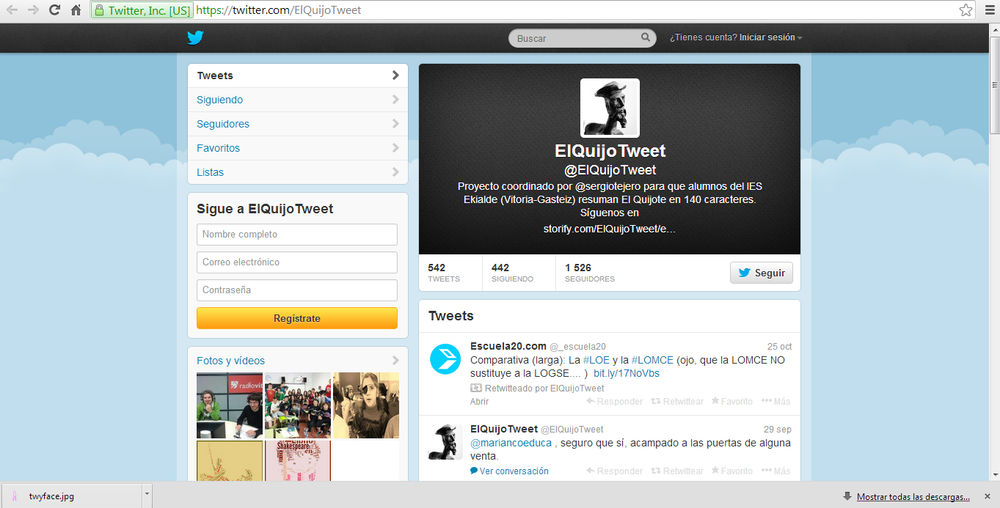
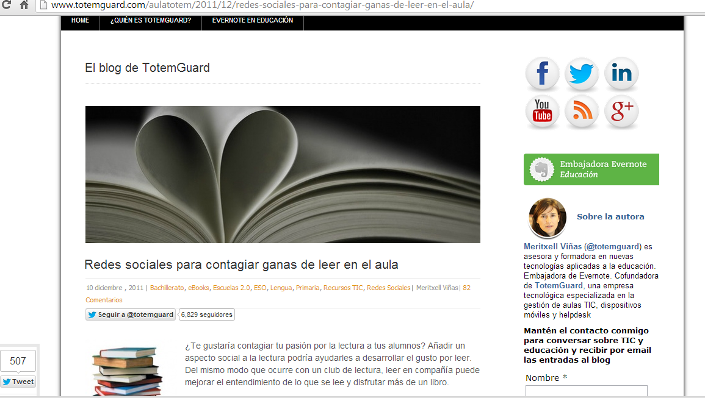

# U.5 EJEMPLOS EDUCATIVOS DEL USO DE LAS REDES SOCIALES EN LENGUA CASTELLANA Y LITERATURA

### Ejemplos educativos del uso de las redes sociales en el área de Lengua

No hay hasta el momento muchas experiencias educativas en la materia de  Lengua Castellana y Literatura, sin embargo, esa situación está cambiando y son más los docentes que incluyen las redes sociales como herramientas para su labor docente. Aquí mostramos algunas:

*   _La generación del 27 en Facebook_: una experiencia educativa que ha liderado la profesora Sonia Martínez, con alumnos y alumnas de 1º de ESO del INS Castellar, de Castellar del Vallès (Barcelona). La información sobre esta experiencia educativa puede consultarse en el [Portafolio del docente](http://primerportafolio.blogspot.com.es/ "Portafolio del docente") de la citada profesora, así como en el capítulo “La generación del 27 en Facebook”, incluido en Hernández Ortega, José, Massimo Penessi Fruscio, Diego Sobrino López y Azucena Vázquez Gutiérrez (coords.), _Experiencias educativas en las aulas del siglo XXI. Innovación con TIC_, Madrid, Fundación Telefónica-Editorial Ariel, 2011, pp. 133-135 (disponible en [PDF](http://ciberespiral.org/attachments/225_Experiencias_educativas20.pdf "Experiencias educativas en las aulas del siglo XXI. Innovación con TIC")). La experiencia también está descrita en la presentación [Facebook en el aula: una experiencia de _roleplaying_](http://www.slideshare.net/sonia_ser/facebook-en-el-aula "Facebook en el aula: una experiencia de roleplaying").
*   _ElQuijoTweet_, [https://twitter.com/ElQuijoTweet](https://twitter.com/ElQuijoTweet "ElQuijoTweet"): una actividad coordinada por el profesor [Sergio Tejero](https://twitter.com/sergiotejero/ "Sergio Tejero"), del IES “Ekialde” de Vitoria, en el que sus alumnos y alumnas se encargan de resumir los capítulos de _El Quijote_ en 140 caracteres. Cada alumno resume un capítulo de la obra en un tuit, y el conjunto de las microentradas se recopila en [Storify](http://storify.com/ElQuijoTweet/ "ElQuijoTweet - Storify"). Para una descripción más detallada de la actividad, véase el artículo publicado en el periódico [El Correo](http://www.elcorreo.com/alava/v/20130119/alava/quijotweet-mancha-20130119.html "El 'QuijoTweet' de La Mancha").

    Fig. 6.18 _Ejemplo del uso de las redes sociales como herramienta educativa_

*   _Lazarillo de Tormes_, [http://twitter.com/Lazarilloiescmc](http://twitter.com/Lazarilloiescmc "LazarillodeTormes"): coordinada por la profesora Aurelia Molina, con alumnos y alumnas de 3º ESO del IES “Concha Méndez Cuesta” de Torremolinos (Málaga). Esta actividad consiste en una adaptación de la novela picaresca al formato de publicación propio de [Twitter](http://twitter.com/ "Twitter"), servicio en el que cada uno de los personajes principales de la novela tiene su propia cuenta. Al igual que en el ejemplo anterior, todos los tuits publicados se recopilan en [Storify](http://storify.com/Lazarilloiescmc/lazarillo-de-tormes "Lazarillo de Tormes - Storify"). Para conocer más detalles sobre la actividad, véase el artículo publicado en el periódico [El Sur](http://www.diariosur.es/v/20120428/malaga/lazarillo-cabe-tweets-20120428.html "El Lazarillo cabe en 104 'tweets'").
*   _Recopilación de recursos web para Lengua de 3º de ESO_, [http://cedec.ite.educacion.es/index.php/es/kubyx/2011/12/03/51-marcadores-cedec](http://cedec.ite.educacion.es/index.php/es/kubyx/2011/12/03/51-marcadores-cedec). Iniciativa del [Centro Nacional de Desarrollo Curricular en Sistemas No Propietarios (CEDEC)](http://cedec.ite.educacion.es/ "Centro Nacional de Desarrollo Curricular en Sistemas No Propietarios (CEDEC)") mediante la cual se pretende recopilar enlaces útiles para la actividad didáctica en el área de Lengua. Los enlaces se ordenan y sistematizan en una cuenta de [Diigo](http://www.diigo.com/list/canal_cedec/lengua-castellana-y-literatura-3-de-eso "CeDeC Centro Nacional de desarrollo curricular's List: Lengua Castellana y Literatura en la E.S.O."), un servicio de marcadores sociales.
*   _Redes sociales para contagiar ganas de leer en el_ _aul__a_,[http://www.totemguard.com/aulatotem/2011/12/redes-sociales-para-contagiar-ganas-de-leer-en-el-aula/](http://www.totemguard.com/aulatotem/2011/12/redes-sociales-para-contagiar-ganas-de-leer-en-el-aula/). No se trata de una experiencia didáctica, sino de un catálogo de servicios de redes sociales que se pueden utilizar para actividades didácticas en el ámbito de la literatura y el fomento de la lectura.

 Fig. 6.19_  Uso educativo de las redes sociales_

*   _Twitter en el aula_, [http://iessanjose.blogspot.com.es/2010/09/twitter-en-el-aula.html](http://iessanjose.blogspot.com.es/2010/09/twitter-en-el-aula.html "Twitter en el aula"). Completo repertorio de actividades educativas para las áreas de lenguas que se pueden llevar a cabo utilizando el popular servicio de microblogging. Es una propuesta del profesor [Ramón Besonias](http://lamiradaperpleja.blogspot.com.es/ "Ramón Besonias").

Véase [http://propuestastic.elarequi.com/propuestas-didacticas/el-trabajo-en-red-y-las-redes-sociales/el-uso-educativo-de-las-redes-sociales/](http://propuestastic.elarequi.com/propuestas-didacticas/el-trabajo-en-red-y-las-redes-sociales/el-uso-educativo-de-las-redes-sociales/)

**Usar Twitter para Fomentar la Escritura Creativa**

[Christopher Pappas](http://elearningindustry.com/bloggers/christopher-pappas "eLearning Industry") tiene una gran cantidad de extraordinarios consejos en su [Guía de Twitter para Profesores](http://elearningindustry.com/the-twitter-guide-for-teachers). El siguiente consejo se relaciona particularmente con el uso de Twitter para fomentar la escritura creativa en los estudiantes:

“_Haz que los estudiantes trabajen en equipo y realicen tormentas de ideas en Twitter._“

Christopher señala que **los estudiantes a menudo se preguntan sobre qué escribir cuando se les asigna una tarea de escritura creativa**. Además, anima a profesores y alumnos a realizar tormentas de ideas para definir la trama y los personajes, con los siguientes pasos:

**Paso 1**  
Una manera sencilla de incentivar la comunicación _online_ es que un grupo tuitee sus ideas usando un hashtag exclusivo. “_Esta conversación tecnológica guiará a los estudiantes a través de un proceso de brainstorming (tormenta de ideas)._” Christopher sugiere que los profesores fijen un plazo límite para un número mínimo de tuits. Al final de este periodo, los estudiantes tendrán buenas ideas sobre las que escribir.

**Paso  2**  
Otro gran consejo de Christopher es desarrollar un argumento a través de un tiempo dedicado a  tuitear sobre “_qué sucede después,_” donde los estudiantes se comunicarán entre sí para desarrollar una historia colaborativamente, estableciendo el tiempo, el escenario y los entresijos de la trama.

**Paso 3**

Usar Twitter para escribir creativamente también le da a los estudiantes la oportunidad de desarrollar personajes respondiendo preguntas como _“¿Cuál es la situación del personaje?”_ y _“¿Cuáles son sus objetivos?”_

Por último, Christopher recomienda que los alumnos usen esta información para escribir un primer borrador. Cuando usen varias veces este enfoque y se acostumbren a ello, la calidad mejorará y poco a poco se convertirán en todos unos expertos.

