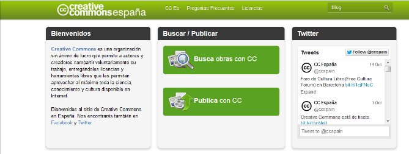

# U.6 ADMINISTRAR RECURSOS E INFORMACIÓN ENCONTRADOS EN INTERNET

**1\. Fiabilidad de la información**

Al buscar la información propuesta anteriormente habrás encontrado que no toda es fiable ni recomendable. Para analizar esto deberás tener en cuenta las siguientes cuestiones:

1.  ¿La web está avalada por alguna institución?
2.  ¿Es fácilmente navegable?
3.  ¿Está bien estructurada?
4.  ¿Es estéticamente agradable?
5.  ¿Cuál es su propósito?
6.  ¿Aparecen fechas de actualización?
7.  ¿A quién va dirigida?

Existen, además, en Internet filtros que sirven para prevenir que se haga un mal uso de la Red. Programas que se pueden descargar de Internet para instalarlo en un ordenador. Su utilidad consiste en filtrar o controlar la información a la que se quiera acceder. 

Puedes descargar filtros gratuitos en la Red. Para encontrar este tipo de aplicaciones puedes usar un buscador o investigar en la web del CNICE, ya que cumple con todos los requisitos de fiabilidad que hemos visto recientemente.

**2\. Registrar las obras propias**

La idea fundamental  de las licencias [Creative Commons](http://es.creativecommons.org/blog/) es formular explícitamente los derechos que tiene la persona que accede a un recurso si quiere volver a publicarlo o combinarlo con otros contenidos. 

Como verás a continuación, no hay una única licencia, sino que se pueden obtener diferentes combinaciones, más o menos restrictivas, mezclando los diferentes niveles de autorización. 

Fig. 2.27_  Página inicial de Creative Commons para registrar las obras propias_

**Tutorial  para insertar una licencia Creative Commons**

        Vídeo 9. Insertar una licencia Creative Commons 

      [www.youtube.com/embed/62Jv3mmRoAc](http://www.youtube.com/embed/62Jv3mmRoAc)

** GNU Free Documention License (GFDL)** ([http://artlibre.org/licence/lal/es](http://artlibre.org/licence/lal/es))

Esta licencia  permite al usuario copiar y redistribuir un trabajo pero exige que todas las copias y derivados queden bajo la misma licencia. 

