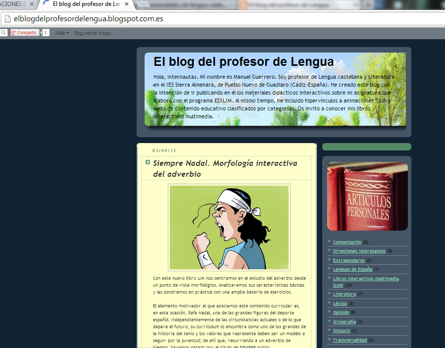
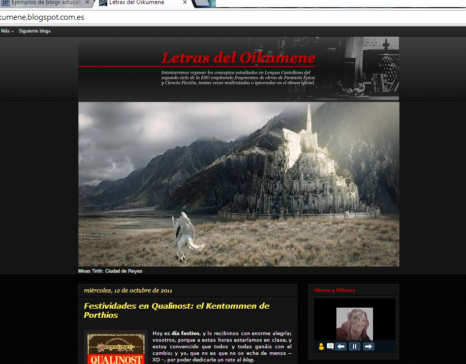
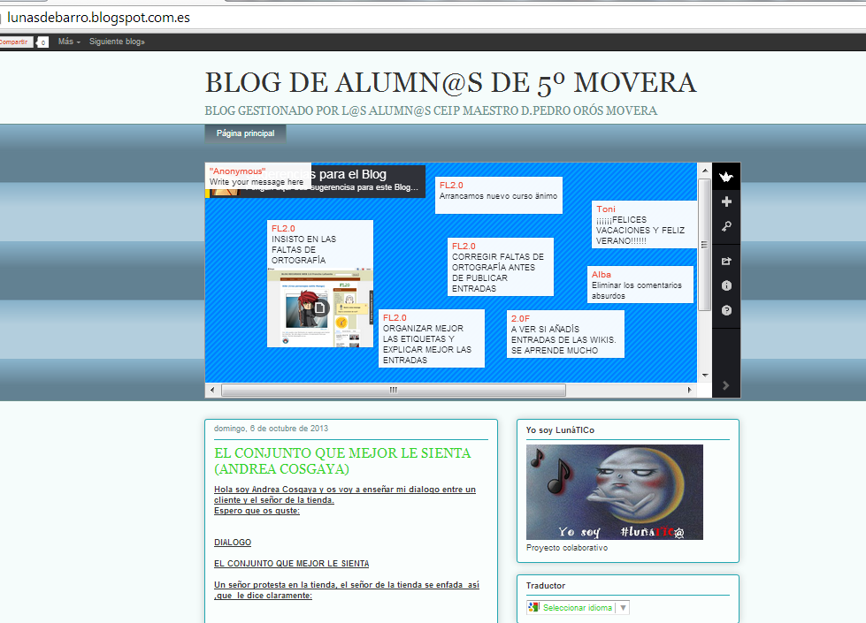

# U.6 APLICACIONES DIDÁCTICAS DE LOS BLOGS

Un blog tiene muchas aplicaciones didácticas  pero, sobre todo, es un medio de comunicación cuyas posibilidades deben ser conocidas por los profesores de Lengua castellana y Literatura para aplicarlas en su práctica educativa diaria.

http://www.youtube.com/watch?v=3Yc4RO4VhMw

**¿Cómo se pueden aprovechar los blogs en nuestra práctica docente?**

Los blogs funcionan a menudo como herramientas sociales dinámicas ya que tiene la opción de responder a las entradas y se actualizan con frecuencia. Aprovechando estas características, podemos utilizar los blogs en diferentes situaciones de enseñanza-aprendizaje como son:

  
• Un blog del grupo clase, de una materia o de una asignatura concreta, con recursos, información adicional y propuestas de actividades complementarias utilizando: la escritura hipertextual, el soporte multimedia, los comentarios, la proposición de enlaces relacionados, etc.

• Blog personal del alumnado a modo de diario individual sobre sus intereses e inquietudes, aficiones, actividades, etc. o participando también en las bitácoras de compañeros/as comentando sus artículos y haciendo aportaciones, propuestas, etc.

  
• Taller creativo multimedia, individual o colectivo, sobre argumentos sugeridos o libres con la posibilidad de incluir todo tipo de referencias, en forma de textos, audio, vídeo o de enlaces a otros sitios.

  
• Gestión de proyectos de grupo como un excelente diario de trabajo donde se guarda el rastro del proceso y la evolución del proyecto.

  
• Publicación electrónica multimedia, periódico escolar, revista digital o monografías sobre diversos temas.

  
• Guía de navegación donde se comentan sitios de interés, noticias y aportaciones en forma de crítica o comentario de los mismos.

**Uso de los blogs en el ámbito educativo**

Podría decirse que el uso de los blogs en el ámbito educativo tiene tres vertientes:

• Profesor - profesor: Un profesor se abre un blog personal para compartir los recursos educativos que genera, intercambiar experiencias y puntos de vista y crear comunidad con otros blogs de profesores/as. Estos blogs son especialmente interesantes por los comentarios, en los que se suelen generar debates muy enriquecedores con profesores y profesoras de distintas regiones.

  
• Profesor - alumnos/as: El profesor genera un blog para ponerse en contacto con sus alumnos/as, en este caso el blog se convierte en una plataforma en la que se publica contenido curricular (ejercicios, textos, material multimedia...).

  
• Alumnos/as - profesor: El profesor crea un blog para el aula en el que son los alumnos/as los que administran el blog (ya sea como ejercicio de clase o de manera voluntaria). El profesor tutoriza la actividad y lo utiliza como sistema de evaluación o como mecanismo de motivación para acercar al alumnado a la lectura, a la escritura y a las nuevas tecnologías.

