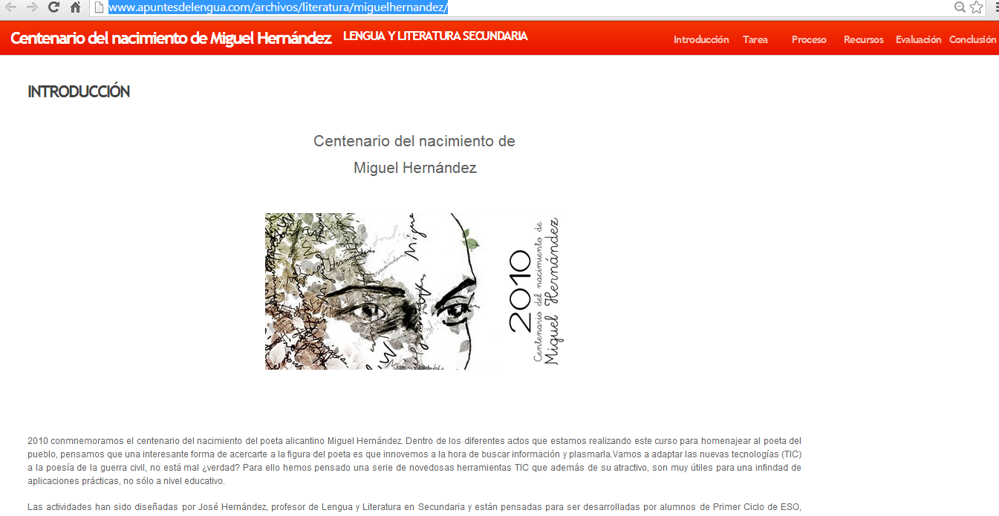
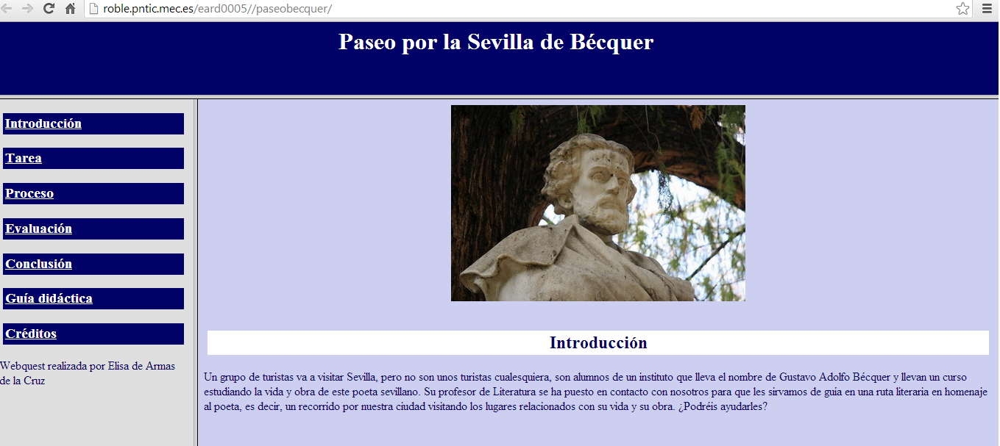

# U.6 WEBQUEST Y CAZAS DEL TESORO DE LENGUA CASTELLANA Y LITERATURA

Los ejemplos de WebQuests  de la materia   de Lengua castellana y Literatura son numerosos, he aquí una pequeña muestra:

*   **Poesía**
    *   Centenario del nacimiento de Miguel Hernández, una webquest completísima creada con motivo de la celebración del nacimiento del poeta:
    *   [http://www.apuntesdelengua.com/archivos/literatura/miguelhernandez/](http://www.apuntesdelengua.com/archivos/literatura/miguelhernandez/)[http://goo.gl/9oLFJ](http://goo.gl/9oLFJ "Centenario del nacimiento de Miguel Hernández")
    
    *    WebQuest sobre Juan Ramón Jiménez. Además, se pueden encontrar en la misma enlaces a otros trabajos sobre este autor y Zenobia Camprubí: 
    *   [http://www.juntadeandalucia.es/averroes/sanwalabonso/wqyct/wq_jrj/portada.htm](http://www.juntadeandalucia.es/averroes/sanwalabonso/wqyct/wq_jrj/portada.htm)

*   **Recreaciones literarias**
    *   Recreamos _El Quijote_, webquest  publicada en _Aula de Letras_, [http://www.auladeletras.net/material/quijote/](http://www.auladeletras.net/material/quijote/ "Recreamos El Quijote"), propone recrear fragmentos de _El Quijote_. 

*   **Autores y épocas literarias**
    *   WebQuest sobre Cervantes [http://www.xtec.cat/~mruiz1/quijote/index.htm](http://www.xtec.cat/~mruiz1/quijote/index.htm)
    *   Caza del tesoro sobre Cervantes su época, vida y obra: [http://www.materialesdelengua.org/LITERATURA/HISTORIA\_LITERATURA/CERVANTES\_ESO/caza_cervantes.htm](http://www.materialesdelengua.org/LITERATURA/HISTORIA_LITERATURA/CERVANTES_ESO/caza_cervantes.htm)
    *   WebQuest sobre el Realismo, [http://webquestrealismo.blogspot.com.es/](http://webquestrealismo.blogspot.com.es/ "Presentamos un autor del Realismo") está alojada en Blogger.
    *   Webquest  sobre Bécquer  titulada: _Paseo por la Sevilla de Bécquer_, [http://roble.pntic.mec.es/eard0005//paseobecquer/](http://roble.pntic.mec.es/eard0005//paseobecquer/).
    

*   **Lengua**
    *   Caza del tesoro muy completa sobre la Real Academia de la Lengua: [http://www.materialesdelengua.org/LENGUA/historialengua/caza\_rae/caza\_rae.htm](http://www.materialesdelengua.org/LENGUA/historialengua/caza_rae/caza_rae.htm)

*   **Tipos de textos**
    *   Caza del tesoro sobre la noticia:[http://www.juntadeandalucia.es/averroes/ceip\_san\_tesifon/recursos/curso6/noticia/index.html](http://www.juntadeandalucia.es/averroes/ceip_san_tesifon/recursos/curso6/noticia/index.html)
    *   _Nuestro álbum de autorretratos_ [https://sites.google.com/site/nuestroalbumdeautorretratos/](https://sites.google.com/site/nuestroalbumdeautorretratos/). Los resultados de esta actividad didáctica han sido descritos por la profesora en el artículo [Un álbum de autorretratos](http://lenguetazosliterarios.blogspot.com/2011/03/un-album-de-autorretratos.html "Un álbum de autorretratos").

Véase [http://propuestastic.elarequi.com/propuestas-didacticas/las-webquests/recursos-sobre-webquests/](http://propuestastic.elarequi.com/propuestas-didacticas/las-webquests/recursos-sobre-webquests/)

