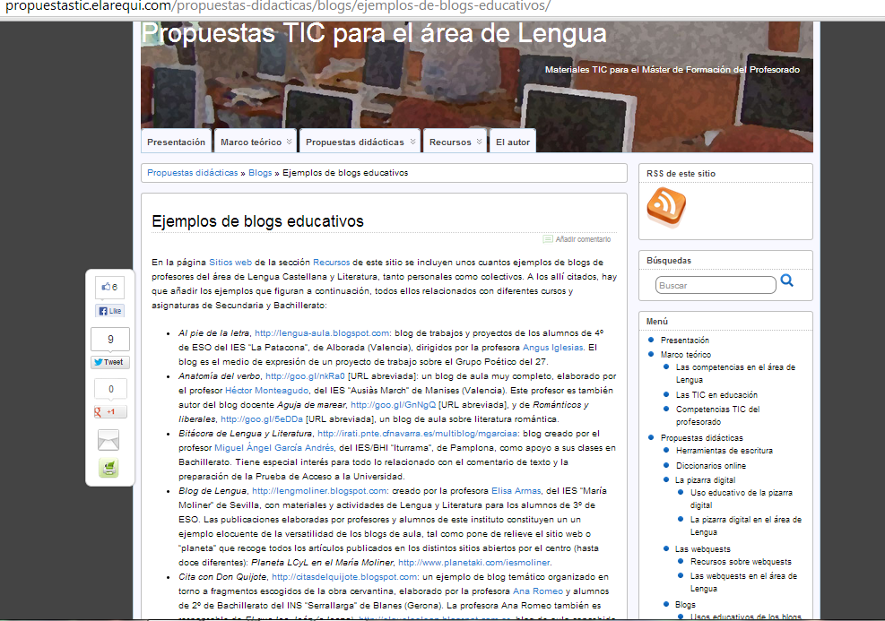
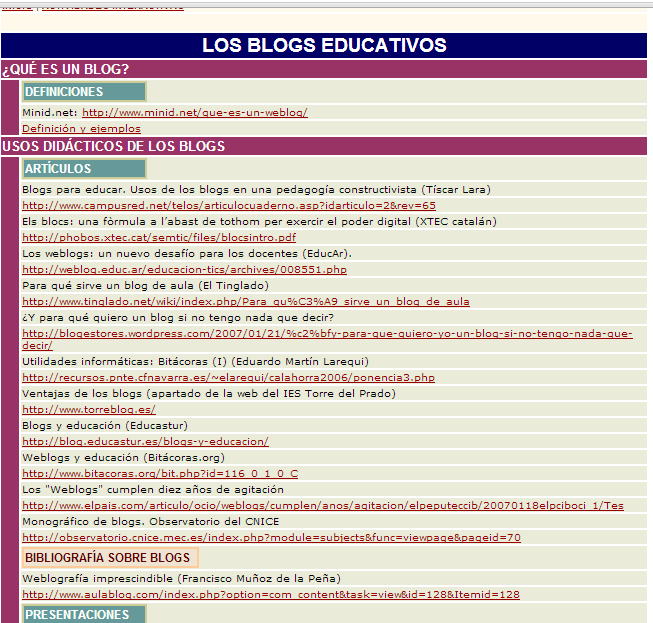
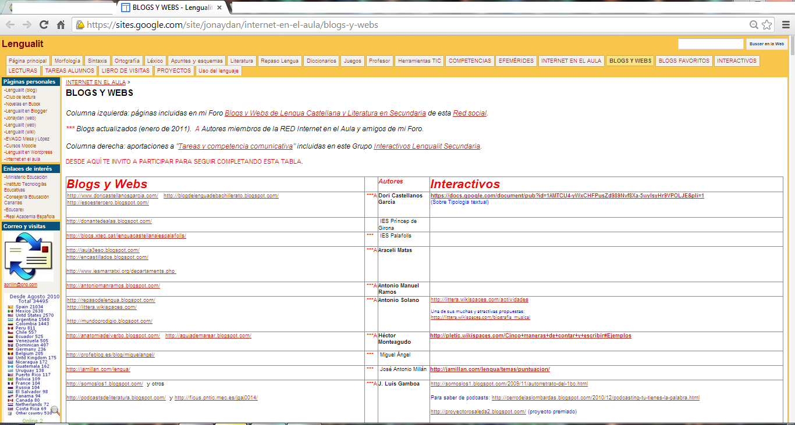
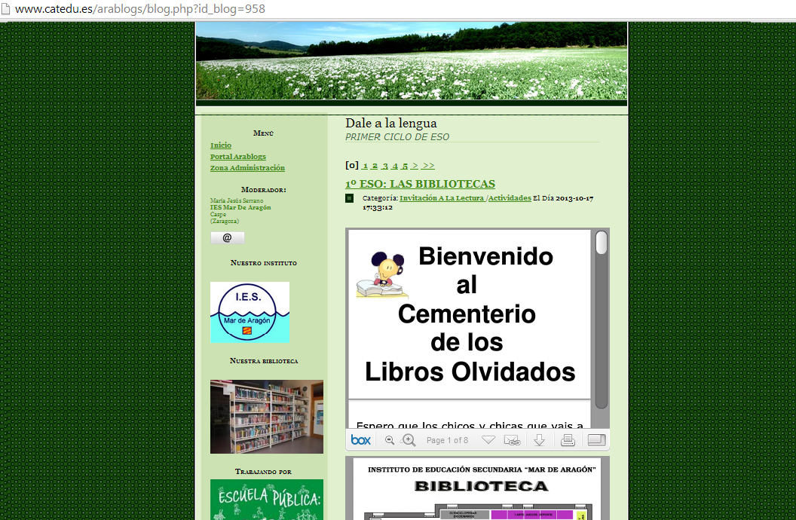

# U.7 EJEMPLOS DE BLOGS EDUCATIVOS

Los blogs, como se ha podido comprobar con la lectura de las páginas anteriores,  se han convertido en una herramienta didáctica gratuita para los docentes. Por sus características y fácilidad de uso, los blogs permiten que cada autor lo configure e introduzca información relacionada con sus intereses. Hay páginas Web que recopilan las direcciones de los mejores blogs didácticos y aportan una breve descripción de los mismos. Muchas son las buenas prácticas docentes, aquí solo vamos a mostrar algunas, sabiendo que hay muchísimas más.

Fig. 1.17_   [Propuestas TIC para el área de Lengua](http://propuestastic.elarequi.com/propuestas-didacticas/blogs/ejemplos-de-blogs-educativos/)_

**Páginas Web donde se recogen direcciones de blogs educativos** 

En esta página se recogen direcciones de blogs educativos de Lengua castellana y Literatura de Secundaria y Bachillerato, y se hace una pequeña reseña de las características de los blogs seleccionados.

[http://propuestastic.elarequi.com/propuestas-didacticas/blogs/ejemplos-de-blogs-educativos/](http://propuestastic.elarequi.com/propuestas-didacticas/blogs/ejemplos-de-blogs-educativos/)

 La siguiente es una recopilación de los mejores blogs educativos, pero sin reseña:

 

Fig. 1.18_  Materiales de Lengua en Blogs._

[http://www.materialesdelengua.org/recursos\_tic/enlaces\_blogs.htm](http://www.materialesdelengua.org/recursos_tic/enlaces_blogs.htm)

El siguiente sitio recoge direcciones de blogs de enseñanza Infantil y Primaria:

[http://www.escuelaenlanube.com/enlaces-de-inters/](http://www.escuelaenlanube.com/enlaces-de-inters/)

En esta Web se presentan blogs de todos los niveles y de todas las materias con una pequeña descripción:

 [http://www.maestroteca.com/blogs-educativos/](http://www.maestroteca.com/blogs-educativos/)

Muchos más ejemplos de blogs de profesores  y blogs de aula relacionados con el área de Lengua Castellana y Literatura pueden encontrarse en la  recopilación realizada por el profesor Ángel Prieto Lino en el wiki [Lengualit](https://sites.google.com/site/jonaydan/internet-en-el-aula/blogs-y-webs)

                                                   Fig. 1.19_  Blogs de Lengua recopilados por Ángel Prieto_

                                      [https://sites.google.com/site/jonaydan/internet-en-el-aula/blogs-y-webs](https://sites.google.com/site/jonaydan/internet-en-el-aula/blogs-y-webs) 

El portal de AraBlogs también es una muy buena fuente de información, pues en él se se recogen todos los blogs publicados en el mismo y se destacan los más visitados.

                           Fig. 1.20_  Blog de primer ciclo de ESO de Lengua castellana: [Dale a la Lengua](http://www.catedu.es/arablogs/blog.php?id_blog=958)_

