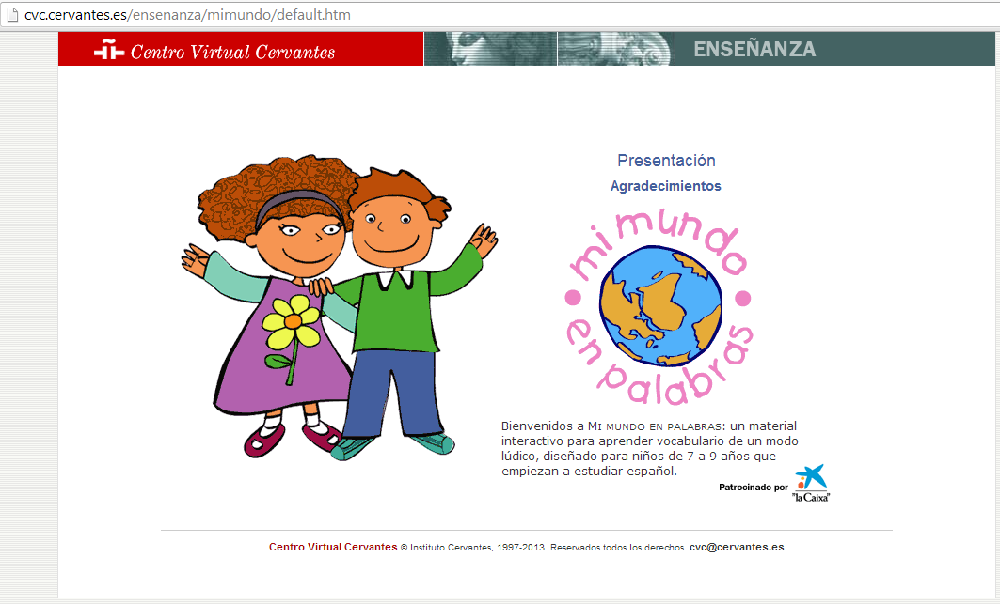

# U.7 RECURSOS SOBRE LENGUA Y LITERATURA EN INTERNET

Muchos son los recursos  de Lengua castellana y Literatura en Internet, de algunos ya hemos tratado en unidades anteriores. Ahora los vamos a agrupar siguiendo el esquema de [http://www.materialesdelengua.org/recursos_tic/enlaces.htm](http://www.materialesdelengua.org/recursos_tic/enlaces.htm) y vamos a seleccionar algunos de ellos.

