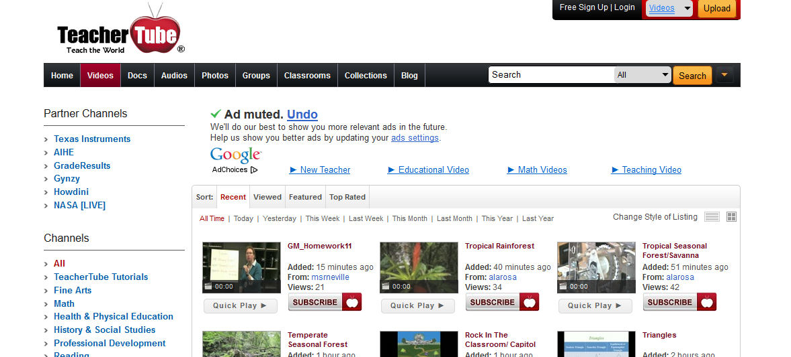
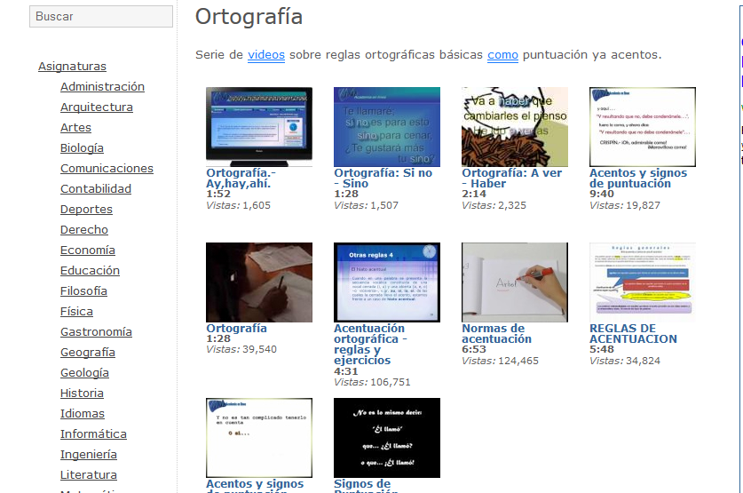

# Videos Educativos

**Vídeos educativos**

 En Internet hay bastantes sitios que alojan vídeos que podemos consultar y embeber en blogs.

**Con contenidos más específicamente relacionados con la educación** 

*   **TeacherTube** ([http://www.teachertube.com/](http://www.teachertube.com/))

Su función es parecida a la de YouTube pero  solo está centrado en la enseñanza. Podemos buscar en su base de datos vídeos, archivos de audio, fotos y documentos en diversos formatos, relacionados con un tema educativo, escribiendo en el buscador las palabras clave apropiadas. Una vez encontrado el archivo deseado, podemos insertarlo en nuestros blogs mediante el texto HTML indicado en "Embeddable Player", o descargarlo haciendo clic sobre "**Download**".  En el caso de los vídeos se descargan en formato FLV.

Fig. 2.16_ Página de inicio de Teacher Tube_

*   **Utubersidad** ([http://utubersidad.com/](http://utubersidad.com/))

En esta página hay más de  1800 vídeos educativos. El objetivo de este sitio es crear un espacio para recoger los contenidos académicos de calidad que se publican en Youtube. En él se recopilan los diferentes materiales audiovisuales de valor didáctico, se agrupan por materias y se  presentan de una manera organizada y sencilla de usar. 

 

                                              Fig. 2. 17  _Vídeos sobre reglas ortográficas en Utubersidad_

**Con todo tipo de contenidos en **

*   Youtube [http://www.youtube.com/](http://www.youtube.com/)

*   Blip.tv ([http://blip.tv)](http://blip.tv)

**Cómo embeber un vídeo de YouTube  **

                                    Vídeo 5. Cómo embeber un vídeo de You Tube

                                 [http://www.youtube.com/watch?v=LJF-dTYn1vY](http://www.youtube.com/watch?v=LJF-dTYn1vY)

## Importante

Te recomendamos el siguiente enlace donde encontrarás toda la información para bajar vídeos  desde Internet:

[http://www.catedu.es/aularagonpowerpoint/TEMATICOS/VIDEOYFLASH/comobajarvideos.html](http://www.catedu.es/aularagonpowerpoint/TEMATICOS/VIDEOYFLASH/comobajarvideos.html)

