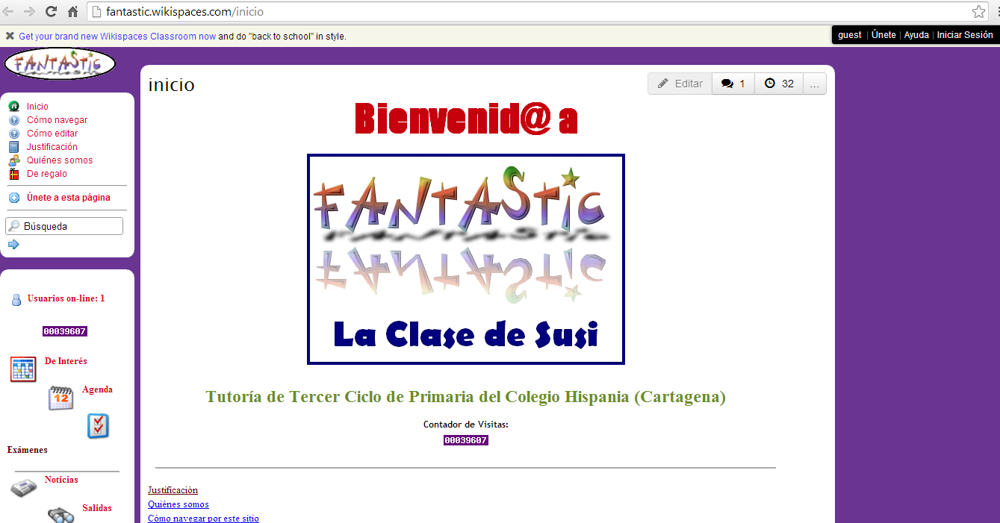

# Wikis educativas de Enseñanza Primaria

  
**Enseñanza Primaria **

Todos los wikis que aparecen a continuación están relacionados con el área de Lengua Castellana y Literatura:

**Wikis de aula**

*   [Fantastic](http://fantastic.wikispaces.com/inicio "http://fantastic.wikispaces.com/inicio"). Wiki de María Jesús Rodríguez Arenas en el que los alumnos y alumnas de la clase de 6º C del Colegio Hispania de Cartagena (Murcia) escriben sus trabajos y la maestra ofrece información sobre el desarrollo del curso. Es un wiki asociado al [Proyecto Fantastic](http://sites.google.com/site/piefantastic/ "http://sites.google.com/site/piefantastic/"), el cual reúne otros espacios dedicados a Educación Infantil e Inglés. El wiki está alojado en [Wikispaces](http://www.wikispaces.com/ "http://www.wikispaces.com").

*   [La Clase de Susi](http://sites.google.com/site/laclasedesusi "http://sites.google.com/site/laclasedesusi"). Continuación y actualización de la wiki anterior, esta vez bajo el soporte de Google sites.

 4.9_ Wiki en Google Sites_

 Experiencias recogidas en [http://recursostic.educacion.es/observatorio/apls/wikiseneducacion/web/index.php/Primaria](http://recursostic.educacion.es/observatorio/apls/wikiseneducacion/web/index.php/Primaria)

**Wikis de relatos.**  

*   Se comienza un relato y se ofrecen unos enlaces para poder construir una narración diferente o complementaria en otras páginas. Véase [Historia de una gaviota](http://narradores.wikispaces.com/Historia+de+una+gaviota "http://narradores.wikispaces.com/Historia+de+una+gaviota"), [Animalico](http://narradores.wikispaces.com/Animalico "http://narradores.wikispaces.com/Animalico"), las dos en [narradores](http://narradores.wikispaces.com/ "http://narradores.wikispaces.com/") del alumnado de Segundo Ciclo de Educación Primaria (3º y 4º cursos) del [CEIP Príncipe Felipe de Motril](http://www.juntadeandalucia.es/averroes/cppfelipe "http://www.juntadeandalucia.es/averroes/cppfelipe"). 

**Wikis de poemas**:

*   Antología de poemas creados por el alumnado. [Quinto en la Red](http://quintoenlared.wikispaces.com/ "http://quintoenlared.wikispaces.com/"). 

**Wikis de diccionarios, enciclopedias, recopilaciones**:

*   [Juegos de Ayer](http://juegosdeayer.wikispaces.com/ "http://juegosdeayer.wikispaces.com/"). Recuperación de juegos antiguos, investigando entre los abuelos y abuelas
*   [Aportar datos](http://es.wikipedia.org/wiki/Niebla_%28Huelva%29 "http://es.wikipedia.org/wiki/Niebla_%28Huelva%29") en una enciclopedia. CEIP San Walabonso

**Wikis de biografías**:

*   [Cronologías para la Paz](http://fgpaez.wikispaces.com/cronologiasparalapaz "http://fgpaez.wikispaces.com/cronologiasparalapaz"). Wiki del CEIP San Walabonso
*   [Zenobia Camprubí](http://es.wikipedia.org/wiki/Zenobia_Camprub%C3%AD "http://es.wikipedia.org/wiki/Zenobia_Camprubí"). CEIP San Walabonso

Experiencias recogidas en [http://recursostic.educacion.es/observatorio/apls/wikiseneducacion/web/index.php/Buenas\_pr%C3%A1cticas\_docentes\_en\_Lengua\_y\_Literaura\_de\_Primaria](http://recursostic.educacion.es/observatorio/apls/wikiseneducacion/web/index.php/Buenas_pr%C3%A1cticas_docentes_en_Lengua_y_Literaura_de_Primaria).

