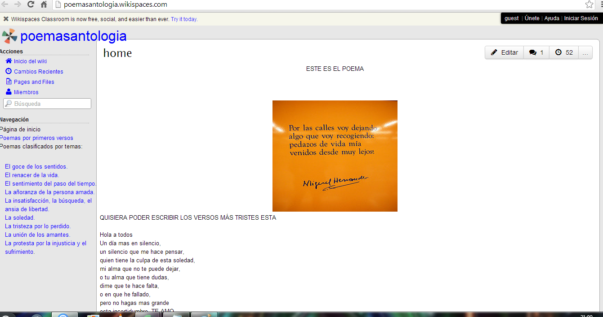
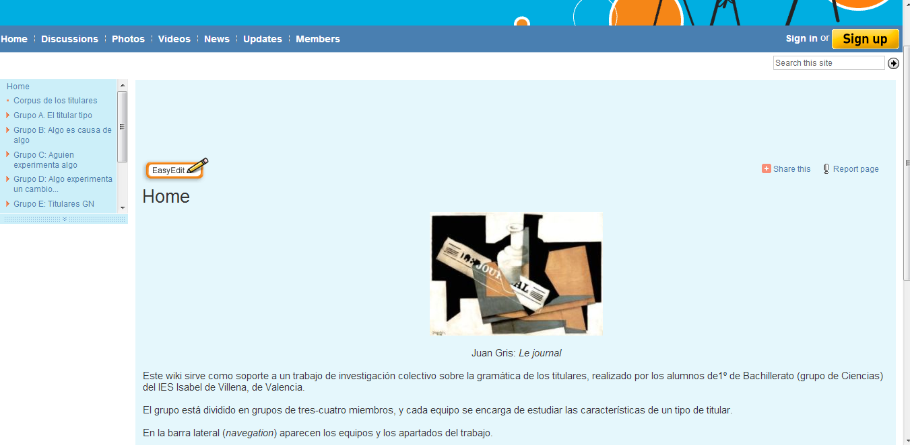

# Wikis educativas de Enseñanza Secundaria y Bachillerato

**Wikis de Departamentos y profesores de Lengua castellana y Literatura**

*   _Lengua Santiago_, [http://lenguasantiago.wikispaces.com](http://lenguasantiago.wikispaces.com/ "LenguaSantiago"), wiki del Departamento de Lengua Castellana y Literatura del IES “Santiago Apóstol” de Almendralejo (Badajoz), que organiza temáticamente una serie de enlaces sobre contenidos relacionados con la didáctica del área.
*   _Littera_, [http://littera.wikispaces.com](http://littera.wikispaces.com/ "Littera"), wiki de recursos educativos del profesor [Antonio Solano](http://repasodelengua.blogspot.com/ "Re(paso) de Lengua"), del IES “Bovalar”, de Castellón. Incluye diversas experiencias didácticas, actividades de animación a la lectura, selección de textos y diversa documentación profesional. Otro wiki muy interesante elaborado por este profesor es _Trabajos monográficos del IES Bovalar_, [http://monograficos-bovalar.nirewiki.com](http://monograficos-bovalar.nirewiki.com/ "Trabajos monográficos del IES Bovalar").

*   _Materiales 2º de Bachillerato_, [http://lenguayliteratura2bac.wikispaces.com](http://lenguayliteratura2bac.wikispaces.com/ "Materiales 2º de Bachillerato"), un wiki tan completo como bien elaborado, que recopila recursos sobre la asignatura de Lengua en dicho curso. Es obra del profesor [Joaquín Mesa](http://www.iesgrancapitan.org/blog05/ "EduCAP-TIC"), del IES “Gran Capitán” de Córdoba, quien también es responsable de otros dos wikis muy recomendables, por lo variado de sus contenidos (¡atención al apartado multimedia!) y el esfuerzo que traslucen todas sus páginas: _La wiki de 3º ESO D_, [http://wikide3esod.wikispaces.com](http://wikide3esod.wikispaces.com/ "La wiki de 3º ESO D"), un wiki de aula, y _La wiki de 3º _
*   _Recursos para la clase de Lengua Castellana y Literatura_, [http://clasedelenguayliteratura.wikispaces.com/](http://clasedelenguayliteratura.wikispaces.com/), extraordinario wiki de la profesora [Ana Basterra](http://anabast.wordpress.com/ "Materiales y Recursos de Aula para el Ámbito Social y Lingüístico"), asesora del Berritzegune de Leioa, con una inmensa cantidad de materiales y recursos educativos para Secundaria y Bachillerato.

**Wikis de poemas**

*   _Antología de poemas_, [http://poemasantologia.wikispaces.com](http://poemasantologia.wikispaces.com/ "Antología de poemas"): wiki elaborado por los alumnos de 2º de ESO del IES “Isabel de Villena” de Valencia, a partir de los textos aportados por su profesor, [Felipe Zayas](http://www.fzayas.com/darlealalengua/ "Darle a la lengua").

                                 

  

*   _Homenaje a Ángel González_, [http://angel-gonzalez.wikispaces.com](http://angel-gonzalez.wikispaces.com/ "Homenaje a Ángel González"), creado por un equipo de más de quince profesores y profesoras,  con motivo del fallecimiento del poeta. Incluye casi setenta poemas, muchos de ellos recitados por los autores del wiki.

**Wikis de teatro**

*   _Manzanas rojas_, [http://manzanasrojas.wikispaces.com](http://manzanasrojas.wikispaces.com/ "Manzanas rojas"), wiki conjunto de varios centros escolares de Cataluña y el País Vasco, que recoge propuestas de lectura a partir de la experiencia de alumnos y alumnas de 2º de ESO sobre la obra homónima del escritor donostiarra [Luis Matilla](http://www.muestrateatro.com/home.html#pagina=/autores/a0069.html "Luis Matilla").

 Experiencias recogidas en [http://propuestastic.elarequi.com/propuestas-didacticas/wikis/ejemplos-de-wikis-educativos/](http://propuestastic.elarequi.com/propuestas-didacticas/wikis/ejemplos-de-wikis-educativos/)

