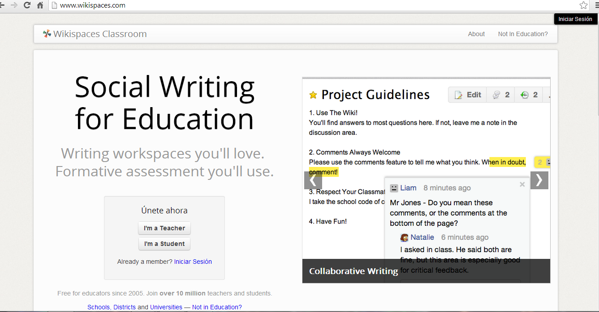
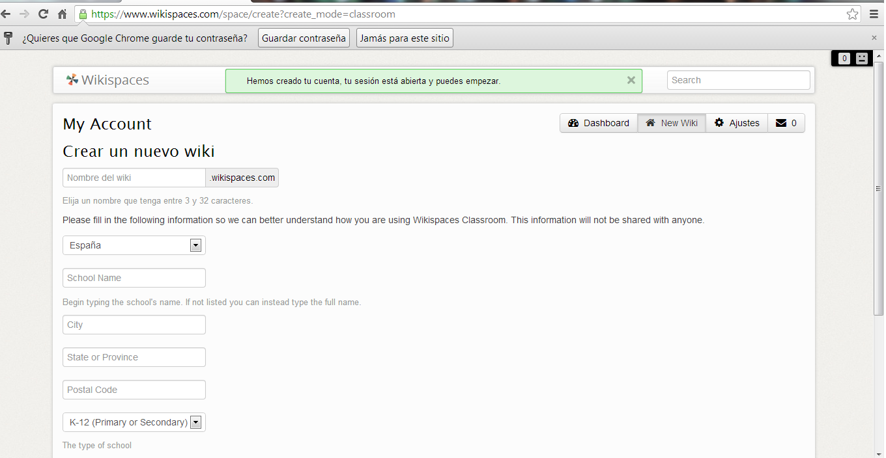

# Wikispaces

**Wikiespaces**

*   ** Registro y creación del wiki**

  
El primer paso para crear un Wiki es ir a la página principal de [wikispaces](http://www.wikispaces.com/home) y registrarnos en el sistema. Para ello sólo habrá que elegir un nombre de usuario y una clave de acceso, proporcionar nuestra dirección de correo y elegir un nombre para el Wiki (prefijo a wikispaces.com).

  

Fig. 4.4  _Página de inicio de Wikispaces_

Una vez registrados, ya podemos crear un wiki

Fig. 4.5 _Crear un wiki en Wikispaces_

*   ** Configuración inicial**
    

 Una vez creado el wiki, hay que configurar algunos aspectos iniciales. Todas las opciones para configurar el wiki están accesibles desde la opción del menú lateral de _Manage Space_:

Wikispaces  proporciona la posibilidad de elegir entre tres tipos diferentes de usuarios:

*   _Public_: cualquier usuario (también anónimos) puede ver y editar las páginas.
*   _Protected:_ cualquiera puede ver las páginas pero sólo los usuarios que son miembros del espacio pueden editar las páginas.
*   _Private_: las páginas sólo pueden ser vistas y modificados por los miembros del wiki.

Una Guía de uso la podemos encontrar en [http://www.catedu.es/facilytic/2013/05/30/wikispaces-un-wiki-para-el-trabajo-colaborativo-y-por-proyectos/](http://www.catedu.es/facilytic/2013/05/30/wikispaces-un-wiki-para-el-trabajo-colaborativo-y-por-proyectos/)

A continuación, te presentamos un vídeo tutorial del uso de Wikispaces para docentes

Vídeo 6. Tutorial crear un wiki con wikispaces [http://www.youtube.com/embed/amuu5MGjJhk](http://www.youtube.com/embed/amuu5MGjJhk)

## Importante

**Wikispaces** es probablemente el mejor wiki para un principiante y es una plataforma capaz para organizaciones más grandes también. Es intuitivamente fácil de configurar y personalizar.  Es la más empleada en el ámbito educativo.

Con un espacio de almacenamiento que va desde 2 GB (libre) y 200 GB (nivel más caro), Wikispaces proporciona suficiente espacio para almacenar tus páginas wiki.

**Principales características de Wikispaces:**

*   Crear múltiples Wikis bajo un solo registro.
*   Sumar usuarios para que publiquen y modifiquen páginas o para que administren el wiki.
*   Tener capacidad de almacenamiento gratuito total de hasta 2GB.
*   Almacenar archivos de hasta 10 MB cada uno.
*   Usar la interfaz en varios idiomas en el modo diseño del wiki.
*   Etiquetar las páginas.
*   Importar automáticamente entradas provenientes de otros blogs.
*   Exportar automáticamente información (páginas) a archivos de diferentes formatos (HTML, texto, Pdf, Zip, Tgz).
*   Disponer de la posibilidad de modificar colores en la plantilla.
*   Tener la posibilidad de agregar al wiki, widgets con diversas funcionalidades.
*   Tener la posibilidad de añadir comentarios y modificar páginas por parte de los usuarios o visitantes al wiki.
*   Consultar estadísticas de la actividad de los lectores del wiki.

